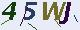
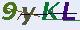

# RsOcr

ddddocr 的 Rust 实现，基于 ONNX Runtime 进行验证码识别。支持多个 ONNX 模型和字符集，可识别简单文本验证码。

## 编译和运行

### 编译

```bash
cargo build --release
```

ONNX Runtime 已**静态链接**到可执行文件中，编译产物为独立 exe，无需额外的动态库文件。首次编译会从网络下载 ONNX Runtime 静态库（需网络连接）。

### 运行

```bash
./target/release/captcha-ocr [OPTIONS]
```

## 参数说明

| 参数 | 说明 | 默认值 |
|------|:----:|:------:|
| `-m <path>` | ONNX 模型路径 | `./common.onnx` |
| `-c <path>` | 字符集文件路径 | 内置 charset3.json |
| `-i <path>` | 识别单张图片 | - |
| `-d <path>` | 识别目录下所有图片 | - |
| `-f` | 显示文件名（格式：filename -> result） | 不显示文件名 |
| `-h` | 显示帮助信息 | - |

**说明**：不指定 `-i` 或 `-d` 时，默认扫描当前目录下的所有图片。

## 支持的模型和字符集

### 推荐配置（新模型）

```bash
./target/release/captcha-ocr -m common.onnx -i image.jpg
```

- **模型**：`common.onnx`（更新更强）
- **字符集**：`charset3.json`（默认，无需指定）
- **识别精度**：更高，可处理粘连字符（如 45WJ）

### 传统配置（旧模型）

```bash
./target/release/captcha-ocr -m common_old.onnx -c charset.json -i image.jpg
```

- **模型**：`common_old.onnx`（轻量级）
- **字符集**：`charset.json`（旧字符集）
- **识别精度**：较低，不可处理粘连字符（识别为 45w）

## 使用示例

```bash
# 推荐：识别单张图片（默认使用新模型 common.onnx 和 charset3.json<已内置> ）
./target/release/captcha-ocr -i image.jpg

# 推荐：识别目录，显示文件名
./target/release/captcha-ocr -f -d ./images/

# 传统：使用旧模型识别，指定旧字符集
./target/release/captcha-ocr -m common_old.onnx -c charset.json -i image.jpg

# 扫描当前目录（默认使用新模型）
./target/release/captcha-ocr
```

## 识别效果对比

### 新模型 (common.onnx + charset3.json<已内置>)

| 图片 | 识别结果 |
|:----:|:-------:|
|  | **45WJ** ✓ |
|  | **9yKL** ✓ |

### 旧模型 (common_old.onnx + charset.json)

| 图片 | 识别结果 |
|:----:|:-------:|
|  | **45w** （缺 J） |
|  | **9yKL** |

## 支持的图片格式

- JPEG / JPG
- PNG
- BMP
- GIF

## 其他

- 首次编译需要下载 ONNX Runtime 静态库
- 生成的 exe 大小约 15-25MB（包含静态链接的 ONNX Runtime）
- 旧模型和新模型使用不同的字符集，混合使用会导致乱码

